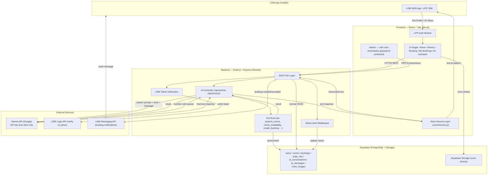
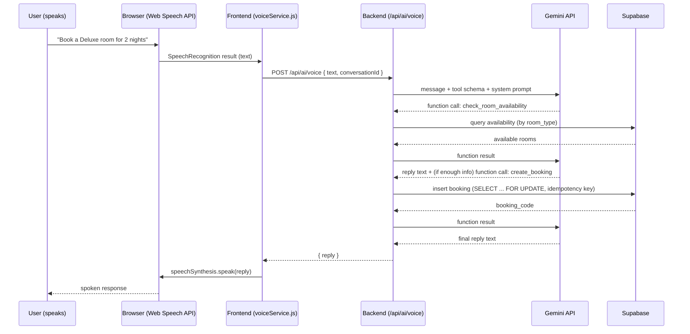

# Hotel Booking + AI Voice Assistant (LINE MINI App)

A hotel room booking system with LINE LIFF login and a Gemini-powered AI
assistant (text + voice) that can search rooms, check availability, and
create real bookings through tool calling — using the exact same backend
API and business rules as the normal booking UI.

## Status

Through Phase 12 of 25 (see `docs/analysis.md` for the full roadmap).
Core booking flow, LINE LIFF login, LINE push notifications, and
text-based AI chat are built and tested. Tool calling for the AI
assistant (Phase 13) is next.

**Note on the AI provider**: the original plan (see `docs/analysis.md`)
specified Claude API (Anthropic). Partway through Phase 12 this was
switched to Google Gemini instead, to use Gemini's free API tier during
development rather than paid Anthropic credits. The diagrams below
reflect the current Gemini-based implementation.

## Architecture



### Voice flow



## Key design decisions

- Frontend never talks to Gemini or the Supabase service role directly —
  only to this backend.
- The Tool Executor is a hard gate: the AI cannot call `create_booking`
  without the code first checking availability. Business rules live in
  code, not just in the system prompt.
- Room search/availability always operates at the `room_type` level, not
  a specific `room_id` — a guest wants "a Deluxe room", not a specific
  room number.
- All "is this date in the past" comparisons are pinned to `Asia/Bangkok`,
  never the server's UTC clock.
- Bookings are created as `confirmed` immediately (no payment step in this
  version); `pending` is reserved for a future payment integration.
- Overlap prevention uses `SELECT ... FOR UPDATE` inside a transaction to
  prevent two simultaneous requests from double-booking the same room.
- Every booking-creating request carries a client-generated idempotency
  key so a network retry can't create a duplicate booking.
- Every booking-affecting request (create/list/cancel, AI chat) is gated
  behind a LINE ID token verified against LINE's own API — the client's
  claimed identity is never trusted directly.

See `docs/analysis.md` for the full project analysis (all 25 phases,
database schema, risk list, and scope decisions) this structure was built
from — note its AI provider references predate the Gemini switch above.

## Repository layout

```
hotel-liff-frontend/   React + Vite frontend (Vercel)
hotel-liff-backend/    Node.js + Express backend (Render)
```

Each has its own `.env.example` — copy to `.env` and fill in values.
Requires: a Supabase project (Phase 3), a LINE Login channel + LIFF app
and a LINE Messaging API channel (Phase 10-11), and a Gemini API key
(Phase 12, free tier at aistudio.google.com).

## Local setup

```bash
cd hotel-liff-backend
npm install
cp .env.example .env
npm run dev
```

```bash
cd hotel-liff-frontend
npm install
cp .env.example .env
npm run dev
```

## Roadmap

25 phases from folder structure to deployment — see `docs/analysis.md`
for the full table. Each phase ships working code, is tested, and is
reviewed before moving to the next.
