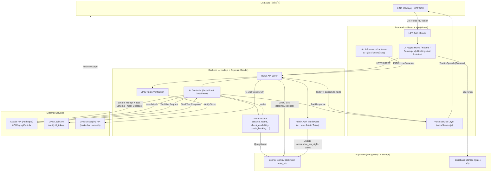
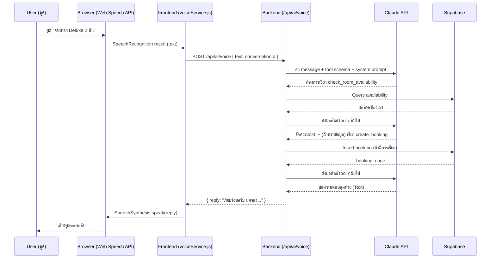

# Hotel Booking + AI Voice Assistant บน LINE MINI App
## เอกสารวิเคราะห์โปรเจกต์ (STEP 1-6)

> เอกสารนี้เป็นการวิเคราะห์และวางแผนก่อนเริ่มเขียนโค้ดจริง ตามที่ตกลงกันไว้ ยังไม่มีการสร้างโปรเจกต์หรือเขียนโค้ดใด ๆ ในขั้นตอนนี้ เมื่อคุณตรวจสอบและอนุมัติแล้ว ให้ตอบว่า **"เริ่ม Phase 1"** เพื่อเริ่มลงมือสร้างจริง

---

## STEP 1: วิเคราะห์โปรเจกต์ทั้งหมด

### 1.1 สรุปสิ่งที่ต้องสร้าง

โปรเจกต์นี้มี 3 ส่วนหลักที่ทำงานร่วมกัน:

1. **ระบบจองห้องพักปกติ (Core Booking System)** — ผู้ใช้ดูโรงแรม ดูห้อง เช็คห้องว่าง จอง ดูรายการจอง ยกเลิกจอง ผ่าน UI ธรรมดา
2. **ระบบยืนยันตัวตนผ่าน LINE (LIFF Integration)** — ผู้ใช้ล็อกอินด้วย LINE โดยไม่ต้องสมัครสมาชิกแยก
3. **AI Voice Assistant** — ผู้ใช้พูดคุยกับ AI ด้วยเสียง โดย AI สามารถ "ลงมือทำ" งานจริงในระบบได้ (ไม่ใช่แค่ตอบคำถาม) ผ่าน Tool Calling ของ Claude

ทั้งสามส่วนนี้ใช้ **Backend และ Database ชุดเดียวกัน** — Booking ที่สร้างผ่านหน้าเว็บปกติ กับ Booking ที่สร้างผ่าน AI ต้องเป็น flow เดียวกันทุกจุด (ผ่าน API เดียวกัน, ตรวจสอบ availability แบบเดียวกัน) เพื่อไม่ให้เกิดข้อมูลไม่ตรงกัน

### 1.2 Feature ที่ซับซ้อนที่สุด (ต้องระวังเป็นพิเศษ)

| Feature | ทำไมถึงซับซ้อน |
|---|---|
| **Booking Overlap Prevention** | ต้องเช็ค date range ทับซ้อนกันจริง ๆ ไม่ใช่แค่เช็ค status ห้ามใช้ logic ผิดแบบ "เช็คแค่ confirmed" |
| **AI Tool Calling ต้องมี Guardrail** | AI ห้ามสร้าง booking ได้เองโดยไม่เช็ค availability ก่อน ต้องบังคับลำดับ: check → create เสมอ |
| **Multi-turn Conversation สำหรับจอง** | ถ้าข้อมูลไม่ครบ (เช่น ไม่บอกวันที่) AI ต้องถามกลับ และ "จำ" บริบทของบทสนทนาไว้ได้ |
| **Voice Architecture ต้องเปลี่ยน Provider ได้ในอนาคต** | เริ่มด้วย Web Speech API (ฟรี) แต่ต้องออกแบบ interface แยกไว้ ไม่ผูกกับ Browser API โดยตรง |
| **Security: API Key ต้องอยู่ Backend เท่านั้น** | ทั้ง Claude API Key และ Supabase Service Role Key ห้ามหลุดไป Frontend เด็ดขาด |
| **LINE LIFF Context** | ต้องแยกให้ออกระหว่าง "รันใน LINE app" กับ "เปิดใน browser ธรรมดา" เพราะพฤติกรรมบางอย่างต่างกัน (เช่น permission microphone ใน LINE in-app browser อาจมีข้อจำกัด) |
| **Race Condition ตอนจองห้อง** | สอง user กดจองห้องเดียวกัน วันเดียวกัน พร้อมกันได้ ถ้าเช็ค availability แล้วค่อย insert แบบธรรมดา ทั้งสอง request อาจเช็คผ่านพร้อมกันก่อน insert ทัน ทำให้ได้ booking ซ้อนกันจริง ต้องป้องกันที่ระดับ database ไม่ใช่แค่โค้ด |
| **LINE ID Token ต้อง Verify จริงทุกครั้ง** | ห้ามเชื่อ `line_user_id` ที่ frontend ส่งมาตรง ๆ (ปลอมง่ายมาก) backend ต้อง verify ID Token กับ LINE API จริงในทุก request ที่กระทบข้อมูล (booking, cancel) |
| **สถานะ Booking ต้องมีคนตัดสินใจเปลี่ยน** | ไม่มีระบบชำระเงิน ดังนั้นต้องกำหนดชัดเจนว่าอะไรจะเปลี่ยนสถานะจาก `pending` เป็น `confirmed` ไม่งั้น booking จะค้างที่ `pending` ตลอดไป |
| **AI ต้องห้ามตอบข้อมูล Dynamic จากความจำตัวเอง** | ต้องมี Guardrail ใน system prompt ห้าม AI เดาราคา/ห้องว่าง ต้องเรียก tool ทุกครั้งที่ต้องใช้ข้อมูลที่เปลี่ยนแปลงได้ |
| **ค้นหาห้องต้องเป็นระดับ "ประเภทห้อง" ไม่ใช่ "ห้องเจาะจง"** | แขกต้องการ "ห้อง Deluxe ว่างไหม" ไม่สนว่าจะได้ห้องเบอร์ไหน ถ้าเช็คแค่ room_id เดียวจะรายงานผลผิดทั้งที่ห้องประเภทเดียวกันห้องอื่นยังว่างอยู่ ต้องค้นหาข้ามห้องทุกห้องที่เป็น room_type เดียวกันเสมอ |
| **สถานะ `completed` ต้องมีกลไกเปลี่ยนอัตโนมัติ** | เหมือนปัญหา pending→confirmed ที่แก้ไปแล้ว แต่ confirmed→completed หลัง check-out ผ่านไปก็ยังไม่มีอะไรเปลี่ยนให้ ถ้าไม่แก้ booking เก่าจะค้างที่ confirmed ตลอดไป |
| **Time Zone ตอนเทียบ "วันนี้"** | Server รันที่ UTC แต่โรงแรมอยู่ไทย (UTC+7) ถ้าไม่บังคับ timezone ตอนเช็ค check-in ไม่ใช่อดีต จะเพี้ยนได้ถึง 7 ชั่วโมงช่วงใกล้เที่ยงคืน |

### 1.3 ความเสี่ยงที่ควรรู้ล่วงหน้า

- **Web Speech API ใน LINE in-app browser**: LINE MINI App เปิดผ่าน WebView ของ LINE ซึ่งบางแพลตฟอร์ม (โดยเฉพาะ iOS) อาจไม่รองรับ `SpeechRecognition` API เต็มรูปแบบ หรือรองรับไม่เท่ากับ Chrome/Safari ปกติ → ต้องมี fallback (เช่น พิมพ์ข้อความแทนพูด) ตั้งแต่ Phase 11 และทดสอบบนอุปกรณ์จริงให้เร็วที่สุด
- **LINE MINI App ต้องสมัครเป็น LINE Developer + ผ่านการตรวจสอบ**: การขึ้นระบบจริงบน LINE ต้องสมัคร LINE Login Channel และ LIFF app ผ่าน LINE Developers Console (ใช้ได้ฟรีสำหรับ Demo/Sandbox แต่การเผยแพร่จริงอาจต้องยื่นขอ LINE MINI App certification ซึ่งมีขั้นตอนเพิ่มเติมและใช้เวลา) — สำหรับ Portfolio เราจะใช้ LIFF app แบบ "Web app type" ซึ่งใช้งานได้เต็มรูปแบบโดยไม่ต้องรอ certification
- **ค่าใช้จ่าย Claude API**: ทุกครั้งที่ AI ตอบ (โดยเฉพาะที่มี Tool Calling หลาย turn) จะมีค่าใช้จ่ายตาม token จึงควรจำกัดการทดสอบและใส่ rate limiting ป้องกันการเรียกซ้ำเกินจำเป็น
- **Time zone**: การจองห้อง (check-in/check-out) ต้องตกลง time zone ให้ชัดเจนตั้งแต่ระดับ Database (แนะนำเก็บเป็น `date` ไม่ใช่ `timestamp` เพราะ check-in/check-out เป็นเรื่องของ "วัน" ไม่ใช่เวลา)
- **ค่าใช้จ่าย Claude API พุ่งจากการเรียกซ้ำ/loop**: ถ้า user กด microphone รัว ๆ หรือ AI เข้า loop tool-calling หลายรอบใน 1 คำถาม ค่าใช้จ่ายจะเพิ่มโดยไม่จำเป็น ต้องมี rate limit และจำกัดจำนวนรอบ tool-call ต่อ 1 turn
- **Booking ซ้ำจาก Retry**: ถ้า network หลุดแล้ว frontend หรือ AI retry คำขอ create_booking ซ้ำ อาจสร้าง booking 2 รายการโดยไม่ตั้งใจ ต้องมีกลไกป้องกัน (idempotency)
- **ราคาที่จองไปแล้วต้องไม่เปลี่ยนตามราคาปัจจุบัน**: เมื่อ admin แก้ `price_per_night` ราคาห้อง booking เก่าที่จองไปแล้วต้อง "คงราคาเดิมตอนจอง" ไว้เสมอ (เก็บใน `bookings.total_price` ซึ่งมีอยู่แล้ว แต่ต้องย้ำใน business logic ว่าห้ามคำนวณราคาจาก `rooms.price_per_night` ปัจจุบันซ้ำตอนแสดงผล booking เก่า)
- **หน้า Admin เพิ่มห้องใหม่ไม่ได้**: ตามที่ออกแบบไว้ หน้า Admin แก้ได้แค่ราคา/สถานะของห้องที่มีอยู่แล้ว ถ้าโรงแรมมีห้องใหม่จริง (เช่น ต่อเติมอาคาร) ยังไม่มีทางเพิ่มห้องผ่าน UI ต้องตัดสินใจว่าจะเพิ่มฟอร์ม "เพิ่มห้องใหม่" ในหน้า Admin ด้วยหรือไม่ (ดูข้อ 4.7)
- **ขาด Validation วันที่และจำนวนผู้เข้าพัก**: ต้องเช็คว่า check-in ไม่ใช่วันที่ผ่านมาแล้ว (`check_in >= วันนี้`) และ guests ไม่เกิน `max_guests` ของห้องนั้น ทั้งฝั่ง UI ปกติและ AI Tool Calling ต้องเช็คเหมือนกัน
- **RLS (Row Level Security) ของ Supabase**: Backend ใช้ Service Role Key ซึ่ง bypass RLS อยู่แล้ว แต่ถ้าไม่ตั้งค่า RLS policy บนตารางไว้เลย หาก Anon Key หลุดหรือถูกใช้ผิดที่ (เช่นใน frontend โดยไม่ตั้งใจ) จะเข้าถึงข้อมูลได้ตรง ๆ ทันที
- **CORS และ Security Headers**: ถ้าไม่จำกัด CORS backend จะรับ request จาก origin ไหนก็ได้ ต้องระบุให้รับเฉพาะ domain ของ frontend บน Vercel เท่านั้น พร้อมใส่ security headers พื้นฐาน
- **Environment Variable ขาดหายตอน Deploy**: ถ้า `.env` บน production ขาดตัวแปรสำคัญ (เช่น ANTHROPIC_API_KEY) โดยไม่ validate ตอน start server จะรันขึ้นมาได้ปกติแต่พังทันทีตอนมีคนเรียกใช้ฟีเจอร์ที่เกี่ยวข้องจริง ซึ่ง debug ยากกว่าที่ควร
- **LIFF Token/Admin JWT หมดอายุระหว่างใช้งาน**: ถ้าไม่มี logic รองรับ user จะเจอ error ค้างโดยไม่รู้สาเหตุเมื่อ token หมดอายุกลางบทสนทนาหรือกลางการแก้ไขราคา
- **เปิดแอปนอก LINE App**: ถ้ามีคนเปิดลิงก์ผ่าน browser ปกติ (ไม่ผ่าน LINE) LIFF SDK จะทำงานไม่เต็มรูปแบบหรือ error เงียบ ๆ ต้องมีข้อความแจ้งชัดเจน
- **ประวัติสนทนา AI ยาวขึ้นเรื่อย ๆ**: ถ้าไม่จำกัดจำนวนข้อความที่ส่งกลับไปให้ Claude ทุกครั้ง ต้นทุนต่อ request จะเพิ่มขึ้นเรื่อย ๆ ตามความยาวบทสนทนา
- **Admin มองไม่เห็น Booking เลย**: หน้า Admin ที่ออกแบบไว้แก้ได้แค่ราคา/สถานะห้อง แต่พนักงานโรงแรมจริงต้องดูว่าใครจองอะไร วันไหนมีแขกเข้าพัก ซึ่งสำคัญกว่าการแก้ราคาด้วยซ้ำ
- **ไม่มีขีดจำกัดการจองล่วงหน้า/ความยาวเข้าพัก**: ถ้าไม่จำกัด ใครจะจองล่วงหน้ากี่ปีหรือพักยาวกี่คืนก็ได้ ทำให้ availability calendar ดูแปลกและเปิดช่องให้ทดสอบ/สแปมได้ง่าย
- **AI ไม่มีทาง "ส่งต่อให้คน" เมื่อช่วยไม่ได้**: ถ้าแขกถามเรื่องที่ AI จัดการไม่ได้ (ขอคืนเงิน, จองกรุ๊ปทัวร์, ร้องเรียน) ต้องมี guardrail ให้แนะนำเบอร์โทรโรงแรมแทนที่จะพยายามตอบเองหรือค้างไม่รู้จะทำอะไรต่อ

> **อัปเดตหลังตรวจสอบร่วมกัน**: ยืนยันขอบเขต MVP ตามข้อ 1.4, ยืนยันเพิ่มตาราง `ai_conversations` / `ai_messages` / `room_images` (ดูข้อ 4.5), Hosting เป็น **Vercel (Frontend) + Render (Backend)**, ยังไม่มี Anthropic API Key / Supabase project (จะแนะนำวิธีสมัครใน Phase 3 และ Phase 12), และเพิ่ม **หน้า Admin เล็ก ๆ สำหรับแก้ราคา/สถานะห้อง** (ดูข้อ 1.4 และ 4.7 — สำคัญมากสำหรับการปรับราคาห้องช่วงเทศกาล)

### 1.4 ขอบเขตที่จะ "ไม่ทำ" ในเวอร์ชัน Portfolio นี้ (เสนอเพื่อความชัดเจน)

เพื่อให้โปรเจกต์จบได้จริงและ Deploy ได้ ขอเสนอตัดขอบเขตต่อไปนี้ออกจาก MVP (แต่ออกแบบโครงสร้างให้ต่อยอดได้ในอนาคต):

- ไม่ทำระบบชำระเงินจริง (payment gateway) — booking จะจบที่สถานะ `pending`/`confirmed` โดยยังไม่ตัดเงินจริง
- ไม่ทำระบบ Admin/Staff dashboard เต็มรูปแบบ (เช่น ไม่มี analytics, ไม่มี role management หลายระดับ, ไม่มีระบบจัดการพนักงาน) — **ยกเว้น**: จะทำ **หน้า Admin เล็ก ๆ** สำหรับแก้ไข "ราคาห้อง" และ "สถานะห้อง" โดยเฉพาะ (ดูข้อ 4.7) เพราะเป็นความจำเป็นพื้นฐานที่โรงแรมต้องใช้จริง (เช่น ปรับราคาช่วงเทศกาล, ปิดห้องเพื่อซ่อมบำรุง)
- ไม่ทำ external Speech-to-Text/Text-to-Speech (เช่น Google Cloud Speech, ElevenLabs) ในเวอร์ชันแรก — ใช้ Web Speech API ก่อน แต่แยก service layer ไว้ตามที่ระบุ
- ไม่ทำ multi-language (จะเป็นภาษาไทยเป็นหลัก แต่โครงสร้างข้อความรองรับการเพิ่มภาษาในอนาคต)

ถ้าคุณต้องการให้ทำข้อไหนด้วย แจ้งได้ก่อนเริ่ม Phase 1

---

## STEP 2: Architecture Diagram

### 2.1 ภาพรวมระบบ (High-Level Architecture)



### 2.2 Voice Flow แบบละเอียด (Sequence)



### 2.3 หลักการสำคัญของ Architecture

- **Frontend ไม่คุยกับ Claude API หรือ Supabase Service Role โดยตรงเด็ดขาด** — คุยกับ Backend เท่านั้น (Frontend ใช้ Supabase Anon Key ได้เฉพาะกรณีอ่านข้อมูล public เช่นรูปภาพจาก Storage หากจำเป็น)
- **Tool Executor เป็นตัวกลางบังคับ business rule** — ไม่ปล่อยให้ Claude เรียก `create_booking` ตรง ๆ โดยไม่ผ่านการเช็ค availability ในโค้ด (ไม่พึ่งแค่ prompt บอก Claude เฉย ๆ)
- **voiceService.js เป็น abstraction layer** — หน้า UI เรียกใช้ `voiceService.startListening()`, `voiceService.speak(text)` โดยไม่รู้ว่าเบื้องหลังเป็น Web Speech API หรือ external provider ทำให้เปลี่ยนได้ในอนาคตโดยไม่กระทบ UI
- **Rate Limiting อยู่ที่ Backend เท่านั้น** — จำกัดจำนวน request ต่อ user ต่อนาทีสำหรับ `/api/ai/*` และจำกัดจำนวนรอบ tool-calling สูงสุดต่อ 1 คำถาม (เช่น ไม่เกิน 5 รอบ) เพื่อคุมค่าใช้จ่าย Claude API และป้องกัน AI เข้า loop
- **LINE Messaging API แยกจาก LIFF Login** — ใช้ LINE Login/LIFF สำหรับยืนยันตัวตนในแอป แต่ใช้ LINE Messaging API (Push Message) เพื่อส่งแจ้งเตือนสถานะการจอง/ยกเลิกกลับไปที่แชท LINE ของผู้ใช้ ทำให้ประสบการณ์ใกล้เคียงระบบจริงมากขึ้น
- **Health Check Endpoint** — `GET /health` คืนสถานะ server และการเชื่อมต่อ Supabase ใช้สำหรับ Render ตรวจสอบว่า service ยังทำงานปกติ (uptime monitoring)
- **Fail Fast บน Environment Variable** — ตอน server start ต้อง validate ว่าตัวแปรสำคัญทั้งหมดมีครบ (ANTHROPIC_API_KEY, SUPABASE_SERVICE_ROLE_KEY, ADMIN_PASSWORD, ADMIN_SECRET ฯลฯ) ถ้าขาดตัวใดตัวหนึ่งให้ server หยุดทำงานทันทีพร้อม error message บอกชัดว่าขาดตัวแปรอะไร แทนที่จะรันขึ้นมาแล้วพังทีหลังตอนมีคนเรียกใช้จริง
- **CORS จำกัดเฉพาะ Frontend Domain** — backend อนุญาตเฉพาะ origin ของ frontend บน Vercel เท่านั้น (ตั้งค่าผ่าน environment variable `ALLOWED_ORIGIN`) พร้อมใส่ Helmet middleware ตั้งค่า security headers พื้นฐาน
- **RLS (Row Level Security) เปิดใช้งานทุกตาราง** — แม้ backend จะใช้ Service Role Key ที่ bypass RLS แต่ยังต้องเปิด RLS และตั้ง policy ปิดกั้น Anon Key ไม่ให้เข้าถึงข้อมูลได้โดยตรง เผื่อกรณี Anon Key ถูกใช้ผิดที่หรือหลุดออกไป
- **สถานะ Booking เริ่มต้นเป็น `confirmed` ทันที (ไม่มีขั้นตอนอนุมัติแยก)** — เนื่องจากไม่มีระบบชำระเงินในเวอร์ชันนี้ Booking ที่ผ่านการเช็ค availability สำเร็จจะถูกสร้างด้วยสถานะ `confirmed` ทันที (ไม่ค้างที่ `pending`) เพื่อให้ flow จบสมบูรณ์และ demo ได้ครบวงจร ส่วนสถานะ `pending` จะสงวนไว้สำหรับกรณีในอนาคตที่เพิ่มระบบชำระเงินจริง (ต้องรอชำระก่อนจึง confirm)
- **ค้นหา/เช็คห้องว่างเป็นระดับ "ประเภทห้อง" เสมอ** — `search_rooms` และ `check_room_availability` ต้องพิจารณาห้องทุกห้องที่เป็น `room_type` เดียวกัน ไม่ใช่ห้องใดห้องหนึ่งเจาะจง ระบบเลือกห้อง (room_id) ที่ว่างจริงให้อัตโนมัติตอน `create_booking` (ดูข้อ 4.13)
- **สถานะ `completed` คำนวณแบบ Virtual ไม่ใช่ Field ที่ต้อง Update เอง** — ไม่ใช้ cron job อัปเดตสถานะ แต่คำนวณจาก `check_out < วันนี้ (Asia/Bangkok)` ตอนแสดงผลแทน (ดูข้อ 4.14) ลดความซับซ้อนและไม่มี job พลาดจังหวะ
- **ทุกการเทียบ "วันนี้" ใช้ Time Zone Asia/Bangkok เสมอ** — ไม่ใช้ `new Date()` ของ server ตรง ๆ (ซึ่งเป็น UTC) ต้องแปลงเป็นเวลาไทยก่อนเปรียบเทียบทุกจุดที่เกี่ยวกับวันที่ (validation, completed status, cancellation policy)

---

## STEP 3: Folder Structure

### 3.1 Frontend (React + Vite)

```
hotel-liff-frontend/
├── public/
│   └── favicon.ico
├── src/
│   ├── main.jsx
│   ├── App.jsx
│   ├── router.jsx
│   ├── config/
│   │   └── env.js                  # อ่านค่า VITE_* environment variables
│   ├── liff/
│   │   ├── liffClient.js           # init LIFF SDK
│   │   ├── useLiffProfile.js       # hook ดึง profile ผู้ใช้
│   │   └── LiffGuard.jsx           # ตรวจสอบว่าเปิดผ่าน LINE App จริง, ถ้าไม่ใช่แสดงข้อความแจ้งให้เปิดผ่าน LINE
│   ├── api/
│   │   ├── httpClient.js           # axios/fetch instance (base URL, headers)
│   │   ├── roomsApi.js
│   │   ├── bookingsApi.js
│   │   └── aiApi.js
│   ├── services/
│   │   └── voiceService.js         # abstraction: startListening / speak / stop
│   ├── pages/
│   │   ├── Home/
│   │   ├── Rooms/
│   │   ├── RoomDetail/
│   │   ├── Booking/                # รวม Availability Calendar แบบง่ายในหน้านี้
│   │   ├── MyBookings/
│   │   ├── AIAssistant/
│   │   └── Admin/                  # หน้าแก้ราคา/สถานะห้อง (แยก route ไม่ผูกกับ LIFF)
│   │       ├── AdminLogin.jsx      # ใส่รหัสผ่าน admin
│   │       ├── AdminRoomList.jsx   # ตาราง list ห้อง + แก้ราคา/สถานะ inline
│   │       ├── AdminRoomCreate.jsx # ฟอร์มเพิ่มห้องใหม่เข้าระบบ
│   │       └── AdminBookingList.jsx # ดู booking ทั้งหมดแบบ read-only (ใครจอง, วันไหน, ห้องอะไร)
│   ├── components/
│   │   ├── layout/                 # Navbar, BottomNav (mobile), PageContainer
│   │   ├── room/                   # RoomCard, RoomFilter
│   │   ├── booking/                # BookingForm, BookingSummary, StatusBadge
│   │   ├── ai/                     # ChatBubble, MicButton, VoiceWaveform
│   │   └── common/                 # Loading, EmptyState, ErrorState, Skeleton, PrivacyNotice (PDPA)
│   ├── context/
│   │   └── UserContext.jsx         # เก็บ LINE user profile ทั้งแอป
│   ├── styles/
│   │   ├── variables.css           # สี, spacing, font ตาม design system
│   │   └── global.css
│   └── utils/
│       ├── formatDate.js
│       ├── formatCurrency.js
│       ├── idempotency.js          # สร้าง idempotency key แบบ random ต่อ 1 flow การจอง
│       └── dateTz.js               # แปลง/เทียบวันที่ด้วย timezone Asia/Bangkok เสมอ
├── .env.example
├── .env                            # (ไม่ commit)
├── index.html
├── package.json
└── vite.config.js
```

### 3.2 Backend (Node.js + Express)

```
hotel-liff-backend/
├── src/
│   ├── server.js                   # entry point
│   ├── app.js                      # express app + middleware setup
│   ├── config/
│   │   ├── env.js                  # อ่าน + validate environment variables (fail fast ถ้าขาด)
│   │   ├── supabaseClient.js       # supabase client (service role)
│   │   ├── cors.js                 # จำกัด CORS เฉพาะ ALLOWED_ORIGIN (frontend บน Vercel)
│   │   └── sentry.js               # (optional) error monitoring
│   ├── routes/
│   │   ├── rooms.routes.js
│   │   ├── bookings.routes.js
│   │   ├── ai.routes.js
│   │   ├── admin.routes.js         # PATCH ราคา/สถานะห้อง + GET bookings ทั้งหมด (ต้องผ่าน admin auth)
│   │   └── health.routes.js        # GET /health สำหรับ Render uptime check
│   ├── controllers/
│   │   ├── rooms.controller.js
│   │   ├── bookings.controller.js
│   │   ├── ai.controller.js
│   │   └── admin.controller.js
│   ├── services/
│   │   ├── rooms.service.js        # business logic ห้องพัก
│   │   ├── bookings.service.js     # business logic + overlap check + idempotency + cancellation policy
│   │   ├── hotelInfo.service.js
│   │   ├── lineMessaging.service.js # ส่ง Push Message แจ้งเตือนจอง/ยกเลิกผ่าน LINE Messaging API
│   │   └── claude/
│   │       ├── claudeClient.js     # เรียก Anthropic SDK
│   │       ├── systemPrompt.js     # system prompt ของ AI + guardrail ส่งต่อให้คนเมื่อ AI ช่วยไม่ได้
│   │       ├── toolSchemas.js      # schema ของ tool ทั้งหมด (search/check ทำงานระดับ room_type)
│   │       └── toolExecutor.js     # map tool name -> function จริง + guardrail
│   ├── middleware/
│   │   ├── errorHandler.js         # แปลง error เป็นข้อความที่ผู้ใช้เข้าใจ
│   │   ├── verifyLineToken.js      # ตรวจสอบ LINE ID Token
│   │   ├── verifyAdminToken.js     # ตรวจสอบ Admin Password/Token แยกจาก LINE Auth
│   │   ├── rateLimiter.js          # จำกัด request ต่อ user ต่อนาที (โดยเฉพาะ /api/ai/*)
│   │   └── validateRequest.js
│   └── utils/
│       ├── dateOverlap.js          # ฟังก์ชันเช็ค date range ทับซ้อน
│       ├── dateTz.js               # แปลง/เทียบวันที่ด้วย timezone Asia/Bangkok เสมอ (ไม่ใช้ server UTC ตรง ๆ)
│       └── logger.js
├── scripts/
│   └── seed.js                     # สคริปต์ใส่ห้องตัวอย่าง + hotel_info เริ่มต้น ใช้ demo ได้ทันทีหลัง deploy
├── tests/
│   ├── dateOverlap.test.js         # unit test ฟังก์ชันเช็ค date overlap
│   └── bookings.service.test.js    # unit test overlap prevention + idempotency
├── .github/
│   └── workflows/
│       └── deploy.yml              # CI/CD: รัน test ก่อน แล้ว auto deploy ไป Render เมื่อ push main
├── .env.example
├── .env                            # (ไม่ commit)
├── package.json
└── server.js
```

### 3.3 Database Migrations

```
hotel-liff-backend/
└── supabase/
    └── migrations/
        ├── 0001_create_users.sql
        ├── 0002_create_rooms.sql
        ├── 0003_create_bookings.sql
        ├── 0004_create_hotel_info.sql
        └── 0005_indexes_and_constraints.sql
```

---

## STEP 4: Database Schema (Supabase / PostgreSQL)

### 4.1 ตาราง `users`

| Column | Type | หมายเหตุ |
|---|---|---|
| id | uuid, PK, default gen_random_uuid() | |
| line_user_id | text, UNIQUE, NOT NULL | ใช้ผูกกับ LINE account |
| display_name | text | |
| picture_url | text | |
| created_at | timestamptz, default now() | |

### 4.2 ตาราง `rooms`

| Column | Type | หมายเหตุ |
|---|---|---|
| id | uuid, PK | |
| room_number | text, UNIQUE | |
| room_type | text | เช่น Standard, Deluxe, Suite |
| name | text | |
| description | text | |
| price_per_night | numeric(10,2) | |
| max_guests | int | |
| bed_type | text | |
| amenities | text[] หรือ jsonb | |
| image_url | text | |
| status | text, default 'active' | active / maintenance / inactive |
| created_at | timestamptz, default now() | |

### 4.3 ตาราง `bookings`

| Column | Type | หมายเหตุ |
|---|---|---|
| id | uuid, PK | |
| booking_code | text, UNIQUE, NOT NULL | เช่น "BK20261013001" |
| user_id | uuid, FK → users.id | |
| room_id | uuid, FK → rooms.id | |
| check_in | date, NOT NULL | ใช้ type `date` ไม่ใช่ timestamp |
| check_out | date, NOT NULL | |
| guests | int, NOT NULL | |
| total_price | numeric(10,2) | **คงค่าราคา ณ ตอนจอง** ไม่คำนวณใหม่จาก `rooms.price_per_night` ปัจจุบันเวลาแสดงผล booking เก่า แม้ admin จะแก้ราคาห้องภายหลัง |
| status | text, default 'pending' | pending / confirmed / cancelled / completed |
| idempotency_key | text, UNIQUE, nullable | ป้องกันสร้าง booking ซ้ำจาก retry (ดูข้อ 4.8) |
| created_at | timestamptz, default now() | |

**Constraint สำคัญ**:
- `CHECK (check_out > check_in)` ที่ระดับ database เพื่อป้องกัน check-out ก่อน check-in ตั้งแต่ชั้น DB (ไม่พึ่งแค่ validation ฝั่ง backend)
- `UNIQUE (idempotency_key)` ป้องกัน request ซ้ำสร้าง booking ซ้ำ (ดูข้อ 4.8)

### 4.4 ตาราง `hotel_info`

| Column | Type | หมายเหตุ |
|---|---|---|
| id | int, PK (แถวเดียว หรือหลายแถวถ้ามีหลายสาขา) | |
| hotel_name | text | |
| address | text | |
| phone | text | |
| check_in_time | text | เช่น "14:00" |
| check_out_time | text | เช่น "12:00" |
| facilities | text[] หรือ jsonb | |
| policies | text | |
| cancellation_days_before | int, default 1 | จำนวนวันล่วงหน้าขั้นต่ำที่ยกเลิกได้ก่อน check-in (ดูข้อ 4.9) |
| max_advance_booking_days | int, default 365 | จองล่วงหน้าได้ไม่เกินกี่วัน (ดูข้อ 4.15) |
| max_length_of_stay_nights | int, default 30 | พักได้ไม่เกินกี่คืนต่อ 1 booking (ดูข้อ 4.15) |

### 4.5 ตารางเพิ่มเติมที่ขอเสนอ (พร้อมเหตุผล)

| ตาราง | เหตุผลที่ควรมี |
|---|---|
| **ai_conversations** (id, user_id, started_at) และ **ai_messages** (id, conversation_id, role, content, tool_name, tool_input, tool_result, created_at) | เพื่อเก็บประวัติแชทของ AI Assistant แยกจาก session ฝั่ง frontend — จำเป็นถ้าต้องการให้ AI "จำบริบท" ข้ามการเปิดแอปใหม่ และมีประโยชน์มากสำหรับ Portfolio (โชว์ได้ว่าออกแบบ conversation history อย่างเป็นระบบ) เพิ่ม column `tool_name`/`tool_input`/`tool_result` (nullable) เพื่อ **log ทุกครั้งที่ AI เรียก tool** ใช้ debug ว่า AI ตัดสินใจเรียกอะไรทำไม (Observability พื้นฐาน) |
| **room_images** (id, room_id, image_url, sort_order) | เผื่อกรณีห้องพักมีหลายรูป ไม่ใช่แค่รูปเดียว (ยืดหยุ่นกว่า image_url เดี่ยวใน rooms) — **เสนอเป็นทางเลือก** ถ้าต้องการ Demo เร็ว ใช้ image_url เดี่ยวใน rooms ไปก่อนได้ |

**ยืนยันแล้ว**: จะสร้างตารางทั้งสามนี้ (`ai_conversations`, `ai_messages`, `room_images`) จริงใน Phase 3

### 4.6 การป้องกัน Booking ซ้อนกัน (Date Overlap) และ Race Condition

หลักการ: สอง date range จะ "ทับซ้อนกัน" ก็ต่อเมื่อ `A.check_in < B.check_out AND A.check_out > B.check_in`

ตัวอย่าง query ตรวจสอบก่อนสร้าง booking ใหม่ (จะอยู่ใน `bookings.service.js` และเรียกใช้ก่อน insert ทุกครั้ง):

```sql
SELECT id FROM bookings
WHERE room_id = :room_id
  AND status IN ('pending', 'confirmed')
  AND check_in < :new_check_out
  AND check_out > :new_check_in;
```

ถ้า query นี้คืนแถวใด ๆ กลับมา = ห้องไม่ว่างในช่วงเวลานั้น ห้ามสร้าง booking ใหม่ (ทั้งจาก UI ปกติและจาก AI Tool Calling ต้องเรียก logic เดียวกันนี้ ไม่มีทางลัด)

**ปัญหา Race Condition**: query ข้างบนอย่างเดียวไม่พอ — ถ้าสอง request (เช่น 2 คนกดจองห้องเดียวกันพร้อมกัน) เช็คก่อนสร้าง booking พร้อมกันเป๊ะ ทั้งคู่จะเห็นว่า "ห้องว่าง" และ insert สำเร็จทั้งคู่ กลายเป็น booking ซ้อนกันจริงในระบบ

**วิธีป้องกัน (จะใช้ใน Phase 7)**: ห่อขั้นตอน "เช็ค availability + insert booking" ไว้ใน PostgreSQL transaction เดียวกัน โดยใช้ `SELECT ... FOR UPDATE` ล็อกแถว booking ที่เกี่ยวข้องของห้องนั้นระหว่างเช็ค เพื่อบังคับให้ request ที่สองต้องรอ request แรกทำ transaction จบก่อน (จึงจะเห็นข้อมูลล่าสุดและถูกปฏิเสธอย่างถูกต้อง) วิธีนี้เป็นวิธีมาตรฐานสำหรับป้องกัน overbooking ในระบบจองจริง ไม่ใช่แค่เทคนิคเสริม

### 4.7 หน้า Admin แก้ราคา/สถานะห้อง (เพิ่มใหม่)

**โจทย์**: โรงแรมต้องปรับราคาห้องช่วงเทศกาล (เช่น สงกรานต์, ปีใหม่) และปิดห้องชั่วคราวเพื่อซ่อมบำรุงได้ โดยไม่ต้องเข้าไปแก้ผ่าน Supabase Table Editor โดยตรง

**แนวทางที่เลือก (เหมาะกับ Beginner และ scope ของ Portfolio)**:

- ไม่ทำระบบ login แบบมี role/permission ซับซ้อน (ไม่ต้องมีตาราง `admin_users` แยก)
- ใช้ **รหัสผ่าน admin ตัวเดียว** เก็บเป็น environment variable ฝั่ง backend เช่น `ADMIN_PASSWORD=...` และ `ADMIN_SECRET=...` (สำหรับเซ็น token)
- หน้า `/admin` (route แยกต่างหาก ไม่ผูกกับ LIFF เพราะ admin เข้าจาก browser คอมพิวเตอร์ปกติ ไม่ใช่จาก LINE) ให้กรอกรหัสผ่าน → backend ตรวจสอบแล้วออก token ชั่วคราว (JWT อายุสั้น เช่น 24 ชม.) → เก็บ token ไว้ใช้เรียก API ที่เหลือ
- หน้า Admin แสดง **ตาราง list ห้องทั้งหมด** พร้อมแก้ไขได้ 2 อย่าง: **ราคาต่อคืน (price_per_night)** และ **สถานะห้อง (status: active/maintenance/inactive)** แบบ inline edit (ไม่ต้องมีฟอร์มซับซ้อน)
- ไม่มี "ตารางราคาแยกตามช่วงเทศกาล" (price_rules) ในเวอร์ชันนี้ — การปรับราคาช่วงเทศกาลทำโดย admin เข้ามาแก้ `price_per_night` ตรง ๆ ก่อนเทศกาลเริ่ม แล้วแก้กลับหลังเทศกาลจบ วิธีนี้เข้าใจง่ายและเพียงพอสำหรับ Portfolio โดยไม่เพิ่มความซับซ้อนของ query ราคาที่ต้อง join กับช่วงวันที่ทุกครั้ง (ถ้าในอนาคตอยากทำแบบอัตโนมัติ ตั้งวันที่ล่วงหน้าได้ ค่อยเพิ่มตาราง `price_rules` ทีหลังได้โดยไม่กระทบโครงสร้างเดิม)

**API เพิ่มเติมสำหรับ Admin** (จะสร้างจริงใน Phase 18):

```
POST  /api/admin/login              → ตรวจสอบรหัสผ่าน, คืน token
GET   /api/admin/rooms              → ดึงห้องทั้งหมด (ต้องมี token)
POST  /api/admin/rooms              → เพิ่มห้องใหม่เข้าระบบ (ต้องมี token)
PATCH /api/admin/rooms/:id          → แก้ price_per_night และ/หรือ status (ต้องมี token)
GET   /api/admin/bookings           → ดึง booking ทั้งหมดแบบ read-only (ต้องมี token, ดูข้อ 4.16)
```

**เพิ่มเติม**: เดิมหน้า Admin ออกแบบไว้ให้แก้ได้แค่ราคา/สถานะของห้องที่มีอยู่แล้ว แต่พบว่าถ้าโรงแรมมีห้องใหม่จริง (เช่น ต่อเติมอาคาร) จะไม่มีทางเพิ่มห้องได้นอกจาก Supabase Table Editor จึงเพิ่มฟอร์ม "เพิ่มห้องใหม่" (`AdminRoomCreate.jsx`) และ endpoint `POST /api/admin/rooms` เข้าไปด้วย เพื่อให้หน้า Admin ใช้บริหารห้องพักได้ครบวงจรจริง

**Security ของหน้า Admin**:
- `verifyAdminToken.js` middleware ตรวจสอบทุก request ไปยัง `/api/admin/*` ยกเว้น `/api/admin/login`
- Rate limit การพยายาม login ผิดรหัส (ป้องกัน brute force)
- Route `/admin` ฝั่ง frontend ไม่ต้องซ่อนหรือทำอะไรพิเศษ เพราะข้อมูลจริงถูกป้องกันที่ backend อยู่แล้ว (ต่อให้เดา URL เจอ ก็เข้าไม่ได้ถ้าไม่มีรหัสผ่าน)

### 4.8 ป้องกัน Booking ซ้ำจาก Retry (Idempotency)

**ปัญหา**: ถ้า network หลุดระหว่างสร้าง booking แล้ว frontend หรือ AI ลอง request `create_booking` ซ้ำอัตโนมัติ (retry) อาจเกิด booking 2 รายการทั้งที่ user ตั้งใจจองแค่ครั้งเดียว

**วิธีแก้**: ทุกครั้งที่เรียก `POST /api/bookings` หรือ tool `create_booking` ฝั่ง client (ทั้ง UI ปกติและ AI) ต้องแนบ `idempotency_key` มาด้วย (สุ่มค่าเดียวตอนเริ่ม flow การจองนั้น ๆ) — backend เช็คก่อนว่ามี booking ที่ใช้ `idempotency_key` นี้แล้วหรือยัง ถ้ามีแล้วคืนผลลัพธ์เดิมกลับไปเลย ไม่สร้างซ้ำ (คอลัมน์ `idempotency_key` ในตาราง `bookings` มี UNIQUE constraint บังคับไว้แล้ว ดูข้อ 4.3)

### 4.9 นโยบายการยกเลิก Booking (Cancellation Policy)

**ปัญหา**: ถ้าไม่มีกฎเลย ผู้ใช้จะยกเลิก booking ได้ตลอดเวลาแม้จะถึงวัน check-in แล้ว ซึ่งไม่สมจริงและโรงแรมจริงไม่ทำแบบนี้

**วิธีแก้**: เพิ่ม field `hotel_info.cancellation_days_before` (ดูข้อ 4.4) กำหนดจำนวนวันขั้นต่ำก่อน check-in ที่ยังยกเลิกได้ (ค่าเริ่มต้น 1 วัน ปรับได้ผ่านหน้า Admin ในอนาคต) — `PATCH /api/bookings/:id/cancel` ต้องเช็คเงื่อนไขนี้ก่อนเปลี่ยน status เป็น `cancelled` ถ้าเกินกำหนดแล้วให้ตอบกลับด้วยข้อความที่เข้าใจง่าย เช่น "ไม่สามารถยกเลิกได้แล้ว เนื่องจากใกล้วันเข้าพัก กรุณาติดต่อโรงแรมโดยตรง"

### 4.10 สถานะ Booking: ใครเปลี่ยน `pending` เป็น `confirmed`

**ปัญหา**: เอกสารเดิมมี status `pending`/`confirmed`/`cancelled`/`completed` แต่ไม่เคยระบุว่าอะไรเปลี่ยนสถานะจาก `pending` เป็น `confirmed` เพราะไม่มีระบบชำระเงินในเวอร์ชันนี้ ถ้าปล่อยไว้แบบนี้ booking ทุกอันจะค้างที่ `pending` ตลอดไปและ flow จะดูไม่จบ

**การตัดสินใจ (สำหรับเวอร์ชัน Portfolio นี้)**: booking ที่ผ่านการเช็ค availability สำเร็จ (ไม่ว่าจะจองผ่าน UI ปกติหรือผ่าน AI) จะถูกสร้างด้วยสถานะ **`confirmed` ทันที** ไม่ผ่านสถานะ `pending` เลย เพราะไม่มีขั้นตอนรอชำระเงินหรือรอโรงแรมอนุมัติ ทำให้ flow "จอง → เห็นผลลัพธ์ทันที" จบสมบูรณ์และ demo ได้เต็มรูปแบบ

สถานะ `pending` ยังคงเก็บไว้ใน enum เผื่ออนาคต — ถ้าเพิ่มระบบชำระเงินจริงทีหลัง จะเปลี่ยน flow เป็น "สร้าง booking เป็น `pending` ก่อน → รอ webhook ยืนยันการชำระเงิน → เปลี่ยนเป็น `confirmed`" ได้โดยไม่กระทบโครงสร้างตารางเดิม

ถ้าคุณต้องการให้ยังคงเป็น `pending` (เช่น ให้ทางโรงแรมต้องกดยืนยันเองก่อน) แจ้งได้ก่อนเริ่ม Phase 1 — จะเปลี่ยนกลับได้ง่าย

### 4.11 Row Level Security (RLS) บน Supabase

Backend เรียก Supabase ด้วย Service Role Key ซึ่ง **bypass RLS โดยอัตโนมัติ** อยู่แล้ว แต่ยังต้อง **เปิด RLS และตั้ง policy ปิดกั้นทุกตารางไว้เป็นค่าเริ่มต้น** (deny-by-default สำหรับ Anon Key) เพราะ:

- ถ้ามีจุดไหนใน frontend เผลอใช้ Anon Key คุยกับ Supabase ตรง ๆ (เช่น ตอนดึงรูปจาก Storage) และตารางไม่มี RLS ป้องกันไว้เลย ข้อมูลทั้งหมด (รวมถึงข้อมูลผู้ใช้คนอื่น) จะเปิดเผยออกไปทันที
- เป็น defense-in-depth (ป้องกันหลายชั้น) มาตรฐานของระบบที่ใช้ Supabase จริง ไม่ใช่แค่พึ่ง backend อย่างเดียว

จะสร้าง policy จริงใน Phase 3 พร้อมกับตาราง

### 4.12 PDPA / ความเป็นส่วนตัวของข้อมูล

เนื่องจากระบบเก็บข้อมูล LINE profile จริงของผู้ใช้ (ชื่อ, รูปโปรไฟล์, LINE User ID) ตาม พ.ร.บ. คุ้มครองข้อมูลส่วนบุคคล (PDPA) ควรมีข้อความแจ้งผู้ใช้สั้น ๆ ก่อนเข้าใช้งานครั้งแรกว่าเก็บข้อมูลอะไรบ้างและใช้เพื่ออะไร (component `PrivacyNotice` ในข้อ 3.1) แม้จะเป็นโปรเจกต์ Portfolio แต่การมี privacy notice แสดงว่าออกแบบระบบโดยคำนึงถึงประเด็นนี้ตั้งแต่ต้น ซึ่งเป็นจุดที่ผู้พิจารณา Portfolio มักมองหา

### 4.13 ค้นหา/จองห้องต้องทำงานระดับ "ประเภทห้อง" ไม่ใช่ "ห้องเจาะจง"

**ปัญหา**: ตาราง `rooms` แทนห้องจริงแต่ละห้อง (แยกด้วย `room_number`) ถ้า tool ของ AI เช็ค availability ของ `room_id` เดียวที่เจาะจง แล้วห้องนั้นไม่ว่าง ระบบจะรายงานว่า "เต็ม" ทั้งที่ห้องประเภทเดียวกันห้องอื่นอาจว่างอยู่ — ในความเป็นจริงแขกไม่สนว่าจะได้ห้องเบอร์ไหน ต้องการแค่ "ห้อง Deluxe ว่างไหม"

**วิธีแก้ (จะใช้ใน Phase 7 และ Phase 13)**:

- `search_rooms` (และ endpoint `POST /api/rooms/check-availability`) รับ `room_type` + ช่วงวันที่ + จำนวนผู้เข้าพัก แล้ว query ห้องทุกห้องที่เป็น `room_type` นั้น กรองเอาเฉพาะห้องที่**ไม่มี booking ทับซ้อน**ในช่วงวันที่นั้นออกมา (ใช้ query overlap เดิมจากข้อ 4.6 กับห้องทุกตัวในกลุ่มประเภทเดียวกัน)
- ผลลัพธ์ที่ AI/UI เห็นคือ "ห้อง Deluxe ว่าง 3 ห้อง" ไม่ใช่สถานะของห้องเดียว
- ตอน `create_booking` ระบบเลือก `room_id` ที่ว่างตัวใดตัวหนึ่งจากกลุ่มที่กรองไว้ให้อัตโนมัติ (เช่น ตัวแรกตามลำดับ room_number) — ผู้ใช้ไม่ต้องเลือกเบอร์ห้องเอง เหมือนระบบจองโรงแรมจริงทั่วไป
- ยังคง lock ด้วย `SELECT ... FOR UPDATE` ที่ระดับห้องที่เลือกจริงตอน insert เพื่อป้องกัน race condition เหมือนเดิม (ข้อ 4.6)

### 4.14 สถานะ `completed` คำนวณแบบ Virtual

**ปัญหา**: เหมือนปัญหา pending→confirmed ที่แก้ไปแล้ว (ข้อ 4.10) แต่สำหรับ confirmed→completed หลังผ่านวัน check-out ไปแล้ว ถ้าไม่มีกลไกใดมาเปลี่ยน status เก่าจะค้างที่ `confirmed` ตลอดไปแม้แขกเช็คเอาท์ไปนานแล้ว

**วิธีแก้ที่เลือก**: ไม่ใช้ cron job มาอัปเดต field จริงในฐานข้อมูล (เพิ่มความซับซ้อนของระบบและมีโอกาส job พลาดจังหวะ) แต่ **คำนวณสถานะที่แสดงผลแบบ virtual** ตอน query แทน — ถ้า `status = 'confirmed'` และ `check_out < วันนี้ (Asia/Bangkok)` ให้แสดงผลเป็น "เสร็จสิ้นแล้ว" ในหน้า My Bookings และหน้า Admin โดยไม่ต้องแก้ค่าจริงในตาราง (field `status` ในฐานข้อมูลยังเป็น `confirmed` เหมือนเดิม เพื่อไม่ให้ query overlap ในข้อ 4.6 ต้องแก้ไข)

### 4.15 ขีดจำกัดการจองล่วงหน้าและความยาวเข้าพัก

**ปัญหา**: ถ้าไม่จำกัด ผู้ใช้ (หรือ AI ที่ตีความคำสั่งผิด) สามารถจองล่วงหน้าหลายปีหรือพักยาวหลายเดือนได้ ทำให้ availability calendar ดูแปลกและเปิดช่องให้ทดสอบ/สแปมระบบได้ง่าย

**วิธีแก้**: เพิ่ม `hotel_info.max_advance_booking_days` (ค่าเริ่มต้น 365 วัน) และ `hotel_info.max_length_of_stay_nights` (ค่าเริ่มต้น 30 คืน) — `bookings.service.js` เช็คทั้งสองเงื่อนไขนี้ก่อนสร้าง booking ทุกครั้ง (ทั้งจาก UI ปกติและ AI) ถ้าเกินให้ตอบข้อความที่เข้าใจง่าย เช่น "ขออภัยครับ ระบบรองรับการจองล่วงหน้าไม่เกิน 1 ปี"

### 4.16 หน้า Admin ดู Booking ทั้งหมด (Read-Only)

**ปัญหา**: หน้า Admin เดิมแก้ได้แค่ราคา/สถานะห้อง แต่พนักงานโรงแรมจริงต้องการเห็นว่าใครจองอะไร วันไหนมีแขกเข้าพัก ซึ่งจำเป็นกว่าการแก้ราคาด้วยซ้ำสำหรับการดำเนินงานประจำวัน

**วิธีแก้**: เพิ่มหน้า `AdminBookingList.jsx` และ endpoint `GET /api/admin/bookings` (ต้องผ่าน admin auth) แสดงรายการ booking ทั้งหมด (booking code, ชื่อผู้จอง, ห้อง, check-in/check-out, สถานะ) แบบ read-only เรียงตามวัน check-in ใกล้สุดก่อน — ยังไม่ทำ action แก้ไข/ยกเลิกจากฝั่ง admin ในเวอร์ชันนี้ (ผู้ใช้ยกเลิกเองผ่านแอปเท่านั้น) เพื่อไม่ให้ scope บวมเกินไป

### 4.17 AI ส่งต่อให้คนเมื่อช่วยไม่ได้ (Human Handoff)

**ปัญหา**: ถ้าแขกถามเรื่องที่ AI จัดการไม่ได้ในระบบนี้ (เช่น ขอคืนเงิน, จองกรุ๊ปทัวร์จำนวนมาก, ร้องเรียนบริการ) AI อาจพยายามตอบเองแบบไม่ถูกต้อง หรือค้างไม่รู้จะทำอะไรต่อ

**วิธีแก้**: เพิ่ม guardrail ใน system prompt ให้ AI รู้ขอบเขตของตัวเอง — เมื่อเจอคำขอที่อยู่นอกเหนือ 6 ฟังก์ชันที่ทำได้ (search/check/create/get/cancel booking + สอบถามข้อมูลโรงแรม) ให้ตอบแนะนำให้ติดต่อโรงแรมโดยตรงพร้อมเบอร์โทรจาก `hotel_info.phone` แทนที่จะพยายามช่วยเกินขอบเขต

---

## STEP 5: Technology และค่าใช้จ่าย

### 5.1 สรุป Stack และหน้าที่

| ส่วน | เทคโนโลยี | ใช้ทำอะไร |
|---|---|---|
| Frontend | React + Vite + JavaScript | UI ทั้งหมด, เรียก Backend API |
| LINE Integration | LIFF SDK + LINE Messaging API | LIFF: Login/ดึง Profile/ID Token — Messaging API: ส่ง Push Message แจ้งเตือนจอง/ยกเลิก |
| Backend | Node.js + Express | REST API, business logic, เชื่อม Claude + Supabase |
| Testing | Jest (หรือ Vitest) | Unit test สำหรับ date overlap และ booking service |
| Security Middleware | Helmet + cors (npm packages) | Security headers พื้นฐาน + จำกัด CORS เฉพาะ frontend domain |
| Error Monitoring (optional) | Sentry (free tier) | จับ error จริงบน production |
| CI/CD | GitHub Actions | รัน test อัตโนมัติ + auto deploy เมื่อ push main |
| Database | Supabase (PostgreSQL) | เก็บข้อมูล users/rooms/bookings/hotel_info |
| Storage | Supabase Storage (ถ้าจำเป็น) | เก็บรูปห้องพัก |
| AI | Claude API (Anthropic) | วิเคราะห์ intent, tool calling, ตอบคำถาม |
| Voice (เริ่มต้น) | Web Speech API (Browser) | Speech-to-Text, Text-to-Speech ฟรี |
| Frontend Hosting | **Vercel** (ยืนยันแล้ว) | Deploy static site ฟรีสำหรับ Portfolio |
| Backend Hosting | **Render** (ยืนยันแล้ว) | Deploy Express server แบบ long-running ไม่มีข้อจำกัด serverless timeout/cold start |

### 5.2 ค่าใช้จ่ายโดยประมาณ (สำหรับ Portfolio/Demo)

| รายการ | ค่าใช้จ่าย | หมายเหตุ |
|---|---|---|
| Supabase | ฟรี (Free tier) | รองรับ 500MB database, เพียงพอสำหรับ Demo |
| Vercel/Netlify (Frontend) | ฟรี | Free tier เพียงพอสำหรับ Portfolio |
| Render (Backend) | ฟรี–$7/เดือน | Free tier มี sleep mode หลังไม่ใช้งาน (~15 นาที) ทำให้ request แรกช้า ถ้าต้องการ demo ตลอดเวลาไม่มีดีเลย์ ควรอัปเป็น Starter plan (~$7/เดือน) ก่อนนำเสนอ Portfolio |
| Claude API (Anthropic) | จ่ายตามการใช้งาน (pay-as-you-go) | ค่าใช้จ่ายขึ้นกับ token และรุ่นโมเดลที่เลือก — สำหรับ Demo/Portfolio ปริมาณการใช้งานต่ำ มักอยู่ในหลักไม่กี่ดอลลาร์ต่อเดือน ควรตรวจสอบราคาปัจจุบันที่ docs.claude.com ก่อนเริ่มเนื่องจากราคาอาจเปลี่ยนแปลง |
| LINE Developers (LIFF + Messaging API) | ฟรี | สร้าง LIFF app และ Messaging API Channel สำหรับทดสอบและ Demo ได้ฟรี ไม่ต้องรอ certification สำหรับ Web app type (Messaging API ฟรีในปริมาณ push message ต่อเดือนที่เพียงพอสำหรับ Demo) |
| Web Speech API | ฟรี | เป็นความสามารถของ Browser ไม่มีค่าใช้จ่ายเพิ่ม |
| Domain (ถ้าต้องการ custom domain) | ~$10-15/ปี | ไม่จำเป็นสำหรับ Portfolio (ใช้ subdomain ฟรีจาก Vercel/Railway ได้) |
| Sentry (Error Monitoring) | ฟรี | Free tier เพียงพอสำหรับ Portfolio/Demo |
| GitHub Actions (CI/CD) | ฟรี | ฟรีสำหรับ public repository และมี free minutes สำหรับ private repository |

**สรุป**: โปรเจกต์นี้สามารถสร้างและ Demo ได้โดยแทบไม่มีค่าใช้จ่ายคงที่ ยกเว้นค่า Claude API ที่จ่ายตามการใช้งานจริง (แนะนำตั้ง budget limit ใน Anthropic Console ไว้ป้องกันการใช้เกิน)

---

## STEP 6: Roadmap (Phase 1-25)

| Phase | ชื่อ | Deliverable หลัก |
|---|---|---|
| 1 | Architecture & Folder Structure | โครงสร้างโปรเจกต์ทั้ง Frontend/Backend พร้อม config เริ่มต้น, README เริ่มต้น (architecture diagram + วิธี setup local) |
| 2 | React + Vite Frontend | Scaffold โปรเจกต์ React, routing, layout พื้นฐาน |
| 3 | Supabase Database | สร้างตารางจริงตาม schema (รวม `idempotency_key`, `cancellation_days_before`, `tool_name`/`tool_input`/`tool_result` ใน ai_messages), เปิด **RLS** พร้อมตั้ง policy ปิดกั้น Anon Key เป็นค่าเริ่มต้นทุกตาราง (ข้อ 4.11), seed script ใส่ห้องตัวอย่าง + hotel_info เริ่มต้น |
| 4 | Backend Node.js + Express | Scaffold server, middleware, error handling พื้นฐาน, `GET /health` endpoint, **env validation แบบ fail-fast**, **CORS + Helmet** จำกัด origin เฉพาะ frontend |
| 5 | เชื่อม React → Backend → Supabase | ทดสอบ end-to-end ว่าดึงข้อมูลจริงได้ (เช่น GET rooms) |
| 6 | ระบบ Room | หน้า Rooms, Room Detail, filter, API /api/rooms |
| 7 | ระบบ Booking (Core) | หน้า Booking, My Bookings, ค้นหา/เช็คห้องว่างระดับ **room_type** (ไม่ใช่ room_id เจาะจง, ข้อ 4.13), overlap prevention ด้วย `SELECT ... FOR UPDATE` (ป้องกัน race condition), idempotency key, validation วันที่ (ใช้ `dateTz.js` timezone Asia/Bangkok, check-in ไม่ใช่อดีต), จำนวนผู้เข้าพัก (ไม่เกิน max_guests), ขีดจำกัดจองล่วงหน้า/ความยาวเข้าพัก (ข้อ 4.15), booking สร้างเป็นสถานะ `confirmed` ทันที (ข้อ 4.10), API bookings, **unit test** สำหรับ dateOverlap และ booking service |
| 8 | Availability Calendar | ปฏิทินแสดงวันที่ห้องเต็ม/ว่างแบบง่าย ในหน้า Booking ก่อนเลือกวันที่ |
| 9 | Booking Cancellation Policy | เพิ่มเงื่อนไขยกเลิกตาม `cancellation_days_before`, ข้อความ error ที่เข้าใจง่ายเมื่อยกเลิกไม่ได้, แสดงสถานะ `completed` แบบ virtual สำหรับ booking ที่ผ่าน check-out ไปแล้ว (ข้อ 4.14) |
| 10 | LINE LIFF / LINE MINI App | Login, Get Profile, ผูก user_id กับ LINE, verify ID Token จริงกับ LINE API ทุก request สำคัญ, `LiffGuard` แจ้งเตือนเมื่อเปิดนอก LINE App, จัดการ token หมดอายุระหว่างใช้งาน |
| 11 | LINE Messaging API (Notification) | ส่ง Push Message แจ้งเตือนเมื่อจอง/ยกเลิกสำเร็จ กลับเข้าแชท LINE ผู้ใช้ |
| 12 | Claude AI Chat | หน้า AI Assistant แบบข้อความ (ยังไม่มีเสียง), เชื่อม Claude API, log การเรียก tool ลง `ai_messages`, **จำกัดความยาวประวัติสนทนา** ที่ส่งกลับไปให้ Claude แต่ละครั้ง, system prompt ห้าม AI ตอบข้อมูล dynamic จากความจำตัวเอง, **guardrail ส่งต่อให้คน** เมื่อเจอคำขอนอกขอบเขต (ข้อ 4.17) |
| 13 | Tool Calling ให้ AI | เพิ่ม search_rooms, check_availability, create_booking ฯลฯ ทำงานระดับ room_type ตามข้อ 4.13 (เรียก idempotency + overlap logic เดียวกับ Phase 7 ไม่มีทางลัด) |
| 14 | Rate Limiting & Cost Control | จำกัด request ต่อ user ต่อนาทีสำหรับ `/api/ai/*`, จำกัดจำนวนรอบ tool-call สูงสุดต่อ 1 คำถาม |
| 15 | Speech-to-Text | เพิ่มปุ่ม microphone, Web Speech Recognition |
| 16 | Text-to-Speech | AI พูดตอบด้วยเสียง |
| 17 | รวม AI + Booking | ทดสอบ flow เต็มรูปแบบ: พูด → จอง → ยืนยัน → ได้รับแจ้งเตือนใน LINE |
| 18 | หน้า Admin แก้ราคา/สถานะห้อง + เพิ่มห้องใหม่ + ดู Booking | Admin login, ตาราง list ห้อง, แก้ price_per_night/status ผ่าน API, ฟอร์มเพิ่มห้องใหม่ `AdminRoomCreate` (ข้อ 4.7), หน้า `AdminBookingList` ดู booking ทั้งหมดแบบ read-only (ข้อ 4.16) |
| 19 | ปรับ UX/UI | Polish ดีไซน์ตาม style guide, micro-interaction, loading/empty/error state, เพิ่ม `PrivacyNotice` (PDPA, ข้อ 4.12) |
| 20 | Security Review | ตรวจสอบ API key, RLS ของ Supabase, input validation, admin token, LINE token verification, ทดสอบ CORS จริง |
| 21 | CI/CD & Error Monitoring | ตั้งค่า GitHub Actions รัน test อัตโนมัติก่อน deploy, เชื่อม Sentry (optional) สำหรับจับ error บน production |
| 22 | Deploy | Deploy Frontend (Vercel) + Backend (Render) ขึ้นจริง, รัน seed script บน production, ตรวจสอบ `/health` |
| 23 | ทดสอบ End-to-End | ทดสอบทุก flow บนอุปกรณ์จริงผ่าน LINE + ทดสอบหน้า Admin + ทดสอบ race condition (จองพร้อมกัน 2 request) + ทดสอบค้นหาห้องข้าม room_type เมื่อห้องเจาะจงเต็มแต่ประเภทเดียวกันยังว่าง |
| 24 | สรุปและทบทวน Portfolio | ตรวจสอบ README ให้ครบถ้วน, เตรียมสคริปต์ demo, ทบทวนขอบเขตที่ตัดออกทั้งหมดว่ายังตรงกับที่ต้องการนำเสนอ |
| 25 | Buffer / แก้ไขปัญหาที่พบระหว่างทดสอบจริง | เผื่อเวลาแก้ bug ที่เจอตอน end-to-end testing ก่อนนำเสนอ Portfolio จริง |

หลักการทำงานร่วมกันในทุก Phase: อธิบายก่อนเริ่ม → ให้โค้ดเต็มไฟล์ → บอกคำสั่ง terminal → บอกวิธีทดสอบและผลลัพธ์ที่คาดหวัง → รอตรวจสอบก่อนไป Phase ถัดไป (ไม่ข้าม Phase)

---

## สรุปการตัดสินใจ (ยืนยันแล้ว — พร้อมเริ่ม Phase 1)

1. ✅ ขอบเขต MVP ตามข้อ 1.4 (ไม่ทำ payment จริง, ไม่ทำ admin dashboard เต็มรูปแบบ ยกเว้นหน้าแก้ราคา/สถานะห้อง)
2. ✅ เพิ่มตาราง `ai_conversations`, `ai_messages`, `room_images`
3. ✅ Hosting: **Vercel (Frontend) + Render (Backend)**
4. ⏳ ยังไม่มี Anthropic API Key และ Supabase project — จะแนะนำวิธีสมัครใน Phase 3 (Supabase) และ Phase 12 (Anthropic API Key)
5. ✅ เพิ่ม **หน้า Admin เล็ก ๆ** สำหรับแก้ไขราคาห้อง (`price_per_night`) และสถานะห้อง (`status`) — ป้องกันด้วยรหัสผ่าน admin ตัวเดียว + JWT token ไม่ทำระบบ role/permission ซับซ้อน (ดูรายละเอียดในข้อ 4.7) เพิ่มเป็น **Phase 18** ใน Roadmap
6. ✅ เพิ่มรายการต่อไปนี้หลังตรวจสอบเอกสารรอบที่สอง เพื่อให้ระบบดูเป็นระบบจริงและใช้งานได้จริงมากขึ้น:
   - **Race condition protection** ด้วย `SELECT ... FOR UPDATE` ตอนจองห้อง (ข้อ 4.6, Phase 7)
   - **Idempotency key** ป้องกัน booking ซ้ำจาก retry (ข้อ 4.8, Phase 7)
   - **Cancellation policy** จำกัดวันยกเลิกล่วงหน้า (ข้อ 4.9, Phase 9)
   - **LINE ID Token verification จริง** ทุก request สำคัญ (ข้อ 1.2, Phase 10)
   - **LINE Messaging API** แจ้งเตือนจอง/ยกเลิกเข้าแชท LINE (Phase 11)
   - **Rate limiting + จำกัดรอบ tool-calling** คุมค่าใช้จ่าย Claude API (Phase 14)
   - **Availability calendar** แบบง่ายในหน้า Booking (Phase 8)
   - **Logging การเรียก tool ของ AI** ลง `ai_messages` เพื่อ debug (Phase 12)
   - **Unit test** สำหรับ date overlap และ booking service (Phase 7)
   - **Seed script**, **README พร้อม architecture diagram**, และ **Health check endpoint** (Phase 1, 3, 4)
7. ✅ เพิ่มรายการต่อไปนี้หลังตรวจสอบเอกสารรอบที่สาม:
   - **สถานะ Booking เป็น `confirmed` ทันที** ไม่ผ่าน `pending` เพราะยังไม่มีระบบชำระเงิน (ข้อ 4.10, Phase 7) — แจ้งได้หากต้องการเปลี่ยนเป็นให้โรงแรมอนุมัติเองก่อน
   - **หน้า Admin เพิ่มห้องใหม่ได้** ไม่ใช่แค่แก้ราคา/สถานะของห้องเดิม (ข้อ 4.7, Phase 18)
   - **Validation วันที่และจำนวนผู้เข้าพัก** (check-in ไม่ใช่อดีต, guests ไม่เกิน max_guests) (Phase 7)
   - **Anti-hallucination guardrail** ใน system prompt ห้าม AI ตอบข้อมูล dynamic จากความจำตัวเอง (Phase 12)
   - **RLS (Row Level Security)** เปิดใช้งานทุกตารางบน Supabase (ข้อ 4.11, Phase 3)
   - **CORS + Helmet** จำกัด origin เฉพาะ frontend และตั้ง security headers พื้นฐาน (Phase 4)
   - **Environment variable validation แบบ fail-fast** ตอน server start (Phase 4)
   - **LiffGuard** แจ้งเตือนเมื่อเปิดแอปนอก LINE App + จัดการ token หมดอายุ (Phase 10)
   - **จำกัดความยาวประวัติสนทนา** ที่ส่งให้ Claude เพื่อคุมต้นทุน (Phase 12)
   - **CI/CD ผ่าน GitHub Actions** และ **Error Monitoring ผ่าน Sentry** (Phase 21, ใหม่)
   - **PDPA Privacy Notice** แจ้งผู้ใช้เรื่องการเก็บข้อมูล LINE profile (ข้อ 4.12, Phase 19)
   - เพิ่ม **Phase 24: สรุปและทบทวน Portfolio** ปิดท้าย Roadmap
8. ✅ เพิ่มรายการต่อไปนี้หลังตรวจสอบเอกสารรอบที่สี่ (เน้นตรรกะทางธุรกิจของโรงแรมจริง):
   - **ค้นหา/จองห้องระดับ room_type ไม่ใช่ room_id เจาะจง** — แก้ปัญหา "รายงานเต็มทั้งที่ห้องประเภทเดียวกันยังว่าง" (ข้อ 4.13, Phase 7 และ 13) — กระทบ tool schema ของ AI โดยตรง
   - **สถานะ `completed` คำนวณแบบ Virtual** จาก check_out เทียบวันนี้ ไม่ต้องพึ่ง cron job (ข้อ 4.14, Phase 9)
   - **Time zone Asia/Bangkok บังคับใช้ทุกจุดที่เทียบวันที่** ผ่าน `dateTz.js` แทนการใช้เวลา UTC ของ server ตรง ๆ (Phase 7)
   - **ขีดจำกัดจองล่วงหน้า/ความยาวเข้าพัก** ผ่าน `hotel_info.max_advance_booking_days` และ `max_length_of_stay_nights` (ข้อ 4.15, Phase 7)
   - **หน้า Admin ดู Booking ทั้งหมดแบบ Read-only** `AdminBookingList` + `GET /api/admin/bookings` (ข้อ 4.16, Phase 18)
   - **AI Human Handoff** — guardrail แนะนำเบอร์โทรโรงแรมเมื่อเจอคำขอนอกขอบเขต (ข้อ 4.17, Phase 12)
   - เพิ่ม **Phase 25: Buffer** เผื่อเวลาแก้ปัญหาที่พบตอนทดสอบจริงก่อนนำเสนอ Portfolio
